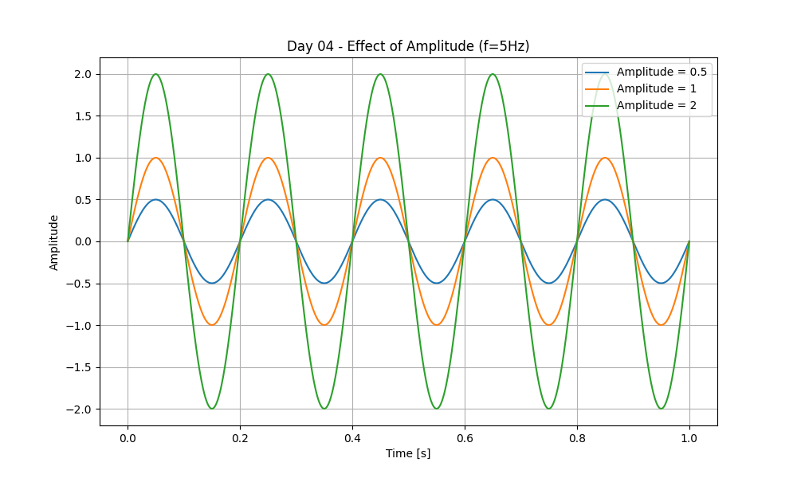

 Day 04 - Amplitude

For today I checked what happens when you change the amplitude of a sine wave.

I kept frequency constant at 5Hz and tried three different amplitudes: 0.5, 1 and 2.

The code is in day04_amplitude.py, I ran it on Pydroid 3 on my phone.

What I saw:
The wave keeps the same shape, but it gets taller when amplitude is higher. With A=2 the peak goes to 2 and -2, with A=0.5 it is much smaller. So amplitude just controls the height / strength of the signal.

Plot:

